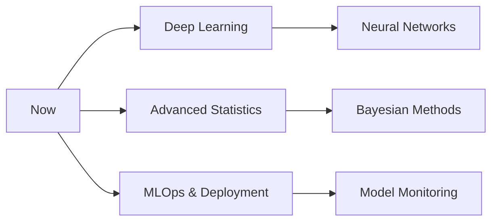

# 👋 Hello, I'm Lesego Radebe

<div align="center">

[](https://git.io/typing-svg)

[](https://www.linkedin.com/in/lesego-radebe-a60b95204/)
[](mailto:rlesego6@gmail.com)
[](https://github.com/lesego1005)
[](https://maps.google.com/?q=Johannesburg)

</div>

---

## About Me

I'm a **data scientist** and **analyst** who thrives on transforming messy, complex datasets into clear, strategic insights that drive business decisions. My approach combines rigorous statistical analysis with creative problem-solving to uncover patterns that others miss.

```python
class DataScientist:
    def __init__(self, name="Lesego"):
        self.name = name
        self.role = "Data Scientist & Analyst"
        self.location = "Johannesburg, ZA"
        self.passion = "Extracting signal from noise"
    
    def current_focus(self):
        return {
            "analysing": ["Customer behavior patterns", "Time-series forecasting", "A/B testing"],
            "building": ["Predictive models", "Interactive dashboards", "ETL pipelines"],
            "learning": ["Advanced statistics", "Deep learning", "MLOps"]
        }
    
    def approach(self):
        return "Ask better questions → Find the data → Extract insights → Drive decisions"
```

** Current Mission:** Building automated data pipelines and machine learning models that turn business questions into quantifiable answers.

---

## Technical Arsenal

### Programming & Data Manipulation


### Data Visualisation & BI


### Machine Learning & Statistics


**Core Techniques:** Regression Analysis • Classification • Clustering (K-Means) • Random Forest • Time Series • Hypothesis Testing • Feature Engineering

### Cloud & Data Engineering


### Development & Collaboration


### Automation & AI Tools


---

## Impact & Achievements

<table>
<tr>
<td width="50%">

### Analysis & Insights
- **20% faster reporting** through Power BI automation
- **90% query resolution rate** via data-driven troubleshooting
- **25% error reduction** in data entry processes
- **Pattern discovery** in customer behavior analytics

</td>
<td width="50%">

### Automation & Engineering
- **60% reduction** in manual data entry via Power Apps
- **40% faster responses** with AI chatbot development
- **Real-time dashboards** with Streamlit deployment
- **End-to-end ETL pipelines** to Azure Blob Storage

</td>
</tr>
</table>

---

## Featured Data Science Projects

### [NYC Airbnb Data Analysis](https://github.com/lesego1005/NYC-Airbnb-Analysis)
> **Python | Pandas | Matplotlib | Seaborn**  
> Uncovered pricing trends, occupancy patterns, and geographic insights from Airbnb data. Clean code, clear insights, compelling visualisations.

**Highlights:** Seasonal demand analysis • Revenue drivers • Host activity patterns

---

### [Music Store Analytics](https://github.com/lesego1005/Music-store-analytics-SQL-project)
> **SQL | Jupysql | Data Analysis**  
> Explored music store data with complex joins, window functions, and KPI calculations. Portable, reproducible, and well-documented.

**Skills Showcased:** Schema exploration • Window functions • Business insights

---

### [Northwind Traders Analytics](https://github.com/lesego1005/northwind_traders_analytics)
> **SQL | Business Intelligence**  
> Sales KPIs, Pareto analysis, employee performance metrics. Fixed tricky table joins and delivered schema-aware analysis with troubleshooting notes.

**Focus Areas:** Revenue analysis • Top performers • Customer metrics

---

## Certifications

**Professional Certifications:**
```
IBM         → Databases and SQL for Data Science with Python (Nov 2025)
Microsoft   → Power Platform Fundamentals (Nov 2025)
Atlassian   → Agile with Jira (Nov 2025)
Google      → Introduction to Generative AI (Oct 2025)
Atlassian   → Version Control with Git (Oct 2025)
```

**Intensive Training:**
- **ExploreAI & ALX Data Science Program** (16 months | May 2023 - Aug 2024)
  - Python, SQL, Machine Learning, Cloud Computing (AWS)
  - Statistical Analysis, Data Visualisation, Model Deployment
  - Agile Methodology, Professional Communication

---

## Current Learning Path



**Currently Exploring:**
- Advanced ML algorithms and ensemble methods
- Causal inference and experimental design
- Cloud-native data architectures (AWS/Azure)
- GenAI integration in analytical workflows
- Real-time data streaming and processing

---

## Data Science Philosophy

> **"Data tells a story, but only if you know which questions to ask."**

### My Analytical Framework:

1. **Question First** → Define the business problem before touching data
2. **Explore Deeply** → Let the data reveal patterns you didn't expect
3. **Visualise Clearly** → Complex analysis means nothing without clear communication
4. **Test Rigorously** → Statistical significance over gut feelings
5. **Deploy Practically** → Models in production > models in notebooks
6. **Iterate Constantly** → The best analysis is the one that improves over time

### I Value:

**Reproducibility** → Version-controlled, documented, replicable analysis  
**Simplicity** → Occam's Razor applies to models too  
**Impact** → Insights that change decisions, not just dashboards that look pretty  
**Ethics** → Responsible AI, bias detection, transparent methodologies  

---

## Let's Collaborate!

I'm always interested in:
- **Data analysis projects** with real-world impact
- **Machine learning challenges** that push boundaries
- **Open-source contributions** in data science tools
- **Knowledge sharing** through blogs, talks, or mentorship

**Reach out if you want to:**
- Discuss data science methodologies and best practices
- Collaborate on analytical projects or research
- Explore opportunities in data science and analytics
- Share insights about the South African tech ecosystem

---

<div align="center">

### Contact Information

[](https://www.linkedin.com/in/lesego-radebe-a60b95204/)
[](mailto:rlesego6@gmail.com)
[](https://github.com/lesego1005)

---


### ⭐ If my work resonates with you, star a repository!

*"In God we trust. All others must bring data." - W. Edwards Deming* 

</div>
